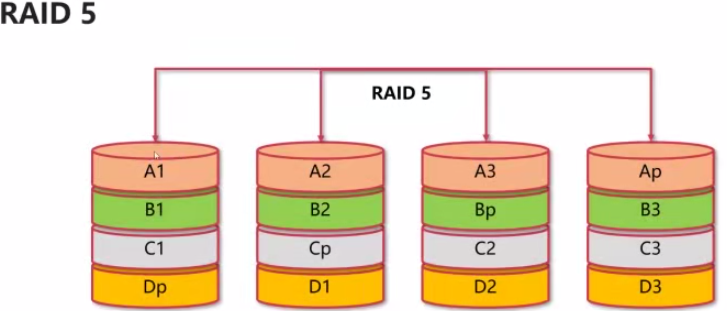
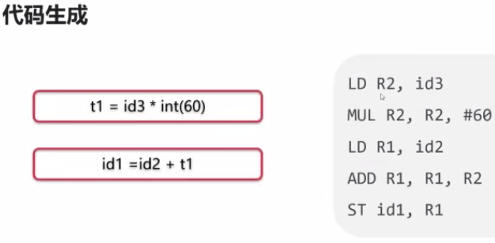
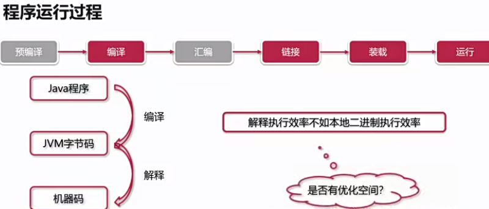
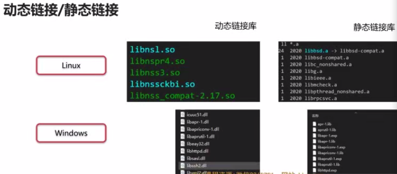
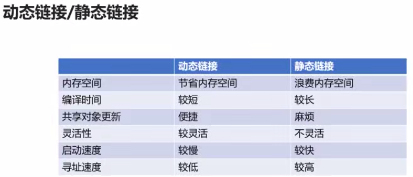
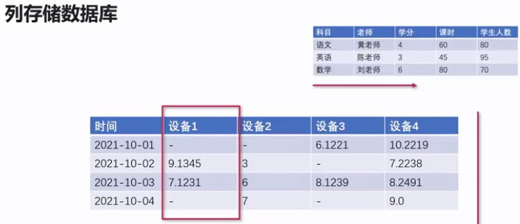
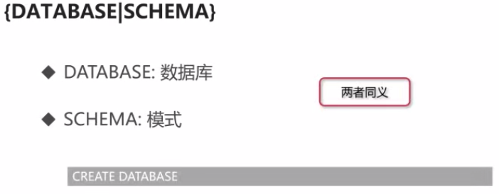
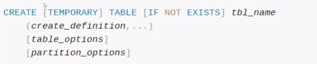
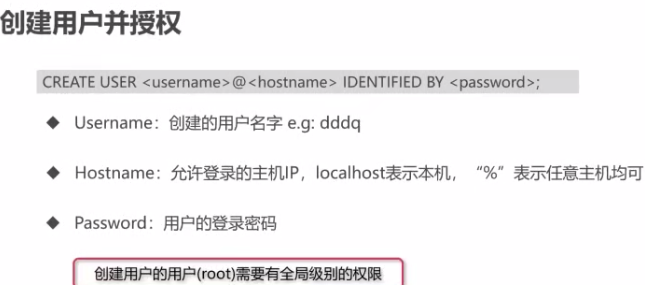
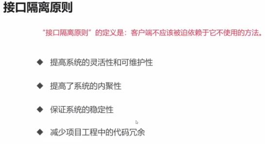

# 八股文

## 一、计算机网络

### 1.1 HTTP、HTTPS、DNS协议

#### 1.1.1 TCP、UDP属于什么层

1. 为什么要分层？

   分层设计：不同层实现不同功能   **类比**  函数设计：函数体不能太长

2. OSI七层作用

3. OSI七层与TCP/IP四层对应关系以及所用协议

4. 每一层的数据结构

5. 网络层特点

6. 传输层特点

7. 应用层特点

> 面试题
>
> ​	1.TCP、UDP、IP协议分别属于什么层
>
> ​	2.网络中传输层有什么作用？它有哪些协议

#### 1.1.2 HTTP1.0、1.1、2.0有什么区别

1. 各版本一些区别
2. keep-alive长连接的好处
3. HTTP2.0头部压缩通过哈夫曼编码和字典实现 

> 1. 简述HTTP1.0，1.1，2.0的主要区别
> 2. HTTP头Connection:Keep-alive是什么意思？解决了什么问题？

#### 1.1.3 HTTP状态码

1. HTTP报文结构

>  比如一个场景
>
> GET https://www/baidu.com HTTP/1.1
>
> Accept-Encoding:gzip
>
> Accept-Language:zh-CN
>
> {
>
> ​	"page":1,
>
> ​	"pageSize":5
>
> }

2. HTTP请求方法

3. 幂等操作：指对同一资源的多次操作，其结果与执行一次操作的效果相同

   幂等函数：指对于相同的输入值，多次调用函数的结果与单次调用的结果相同

4. HTTP状态码
5. 一些常见的状态码
6. 网关分配资源

#### 1.1.4 对称加密和非对称加密

1. 一种安全传输模型
2. 古典密码学是通过一一映射的，但是可以通过频率统计出来
3. 对称加密
4. 非对称加密
5. 对比
6. 哈希散列不是加密算法，因为哈希是单向的，不具备解密能力。即使通过哈希函数将用户密码保存进数据库了，也有风险被黑客破解(时间暴力枚举等等)，这时可以在哈希之前**加盐**，加盐就是在进行哈希散列的时候自定义一个字符串，将该字符串和原密码拼接，最后将这个整体一起哈希散列，加大破译难度

#### 1.1.5 HTTPS加密认证--TLS技术

1. HTTP与HTTPS对比
2. TLS
3. 数字证书，类似身份证，使用非对称加密

#### 1.1.6 域名系统DNS

1. 进程服务：IP+端口，比如115.182.41.180:443，但是这样太难记住了，那么
2. 域名工作原理
   1. 域名由点、字母、数字组成
   2. 点分隔不同域
   3. 域名分为顶级域、二级域、三级域
   4. 比如 www.baidu.com，www是三级域、baidu是二级域、com是顶级域
3. 那么这些域就组成了一棵树
4. DNS会优先在本机hosts文件里查找是否有映射，然后通过迭代或者递归查询

#### 1.1.7 DNS攻击

1. 比如我们请求的url是www.baidu.com，但是经过DNS解析后返回的是www.twly.com，将正常站点解析到恶意页面(赚取游戏推广费等等)
2. DNS劫持
3. DNS欺骗
4. DDos攻击是大量请求DNS解析服务器，使得网络或者系统资源耗尽，让服务中断或者停止，这样其他用户就无法正常访问了，防范手段：
   1. DNS服务商角度：提高本机安全些
   2. 个人角度：选择更加权威的服务商

### 1.2 IP、TCP、UDP协议

#### 1.2.1 TCP、UDP的区别 

1. UDP协议 
2. TCP协议
3. UDP vs TCP应用场景DNS通常处理大量的短期请求，而且这些请求的响应需要在短时间内迅速返回。UDP是无连接的，没有复杂的握手和确认过程，因此在速度和效率方面比TCP更合适。 DNS服务器通常面对的是大量的短暂请求，而非大量长连接。UDP在这种情境下更为适用，因为它允许更高的并发连接数量。

#### 1.2.2 TCP三次握手

1. 三次握手图解
2. 异常情况如果是两次握手，那么如果因为滞慢等原因没有及时传达，那就建立起两次连接，造成资源浪费如果是三次握手，就会保证建立的连接是可靠的、无差错的

#### 1.2.3 TCP四次挥手

1. TCP的释放
2. TIME-WAIT
3. TCP可靠运输-滑动窗口

4. 停止-等待协议
5. ARQ协议
6. 滑动窗口使得信息传递不再是串联，提高了速度

#### 1.2.4 TCP拥塞避免算法

1. 定义：拥塞是很多原因引发的，是一个全局问题
2. 慢开始与拥塞避免
3. 快重传与快恢复

#### 1.2.5 TCP粘包原理

1. 粘包并不是TCP协议造成的，而是应用层协议设计缺陷造成的
2. 应用层数据拆分
   1. 基于长度的标识
   2. 基于特殊分隔符
3. Nagle算法
4. 总结
5. TCP协议安全性
   1. SYN flood攻击，攻击方即是主动发送方
   2. 资源耗尽类攻击
   3. 协议特性漏洞攻击
   4. 防范手段

#### 1.2.6 虚拟专用网VPN

1. 场景
   1. 公司内网
   2. 校园网
   3. 工业专用网
2. 专用IP地址
3. 工作原理

## 二、操作系统

### 2.1 进程、线程和协程

#### 2.1.1 进程

1. 演进历史
2. 多道程序设计
   1. 在计算机内存中同时存放多个程序
   2. 在计算机的管理程序之下相互穿插运行 
   3. 用户无需面向硬件接口编程
   4. IO设备管理软件，提供读写接口
   5. 文件管理软件，提供操作文件接口
   6. **操作系统实现了对计算机硬件资源的管理和抽象**
3. 怎么隔离资源？调度程序？提高利用率？

#### 2.1.2 同步与异步

1. 五状态模型：创建、就绪、终止、阻塞、运行关系图如上，创建状态如下终止状态如上，完整关系图如下
2. 阻塞、非阻塞、同步、异步阻塞是由同步造成的一些常见的阻塞情况非阻塞的情况非阻塞就是通顺，是多路并行，是高效异步

#### 2.1.3  进程和线程的区别

1. 线程是什么线程共享进程资源二者对比多线程就可以充分利用CPU的资源

#### 2.1.4 用户态和内核态

1. 操作系统资源管理
   1. 处理器资源
   2. IO设备资源
   3. 存储器资源
   4. 文件资源
2. Linux设计
   1. 对不同操作赋予不同的执行等级
   2. 与系统相关的特别操作必须由最高权限完成
3. 内核态
4. 用户态
5. 二者切换的时机

#### 2.1.5 IO密集服务

1. 计算密集型
2. IO密集型
3. 对于计算密集型，应该使用多线程去充分利用CPU资源。对于IO密集，提升多线程效率已经没什么用了，但是可以提高硬盘读写速度
4. 服务部署

#### 2.1.6 协程

1. 上下文切换上下文切换势必有资源开销，那么进程与进程间的切换肯定是最大的
2. 协程协程的本质是用户级线程，一般的线程是内核级线程
3. 为什么协程叫做协作式线程？因为协程之间是相互让步、相互协作的。由用户自行调度，内核无法干涉。线程对协程是一对多
4. 协程优缺点

### 2.2 存储系统详解

#### 2.2.1 缓存

1. 层次结构
2. 局部性原理
3. 缓存的设计

#### 2.2.2 虚拟内存

1. 概述
2. 当缓存没有数据时
3. 当主存没有数据时
4. 总结

#### 2.2.3 缺页中断

1. 操作系统如何管理进程空间
2. 内存管理
   1. 页式存储管理
   2. 段氏存储管理
   3. 段页式存储管理
3. 页式存储管理
4. 段氏存储管理
5. 段页式存储管理
6. 缺页中断系统调用属于内核态

#### 2.2.4 页面置换算法

1. 页面置换时机
2. 缓存置换算法
   1. 先进先出 FIFO
   2. 最近最少使用 LRU
   3. 最不经常使用 LFU
3. 先进先出，类似队列
4. 最不经常使用 
5. 最近最少使用跟FIFO类似，但FIFO是严格的队列。而LRU是会“插队”的  

#### 2.2.5 软链接与硬链接

1. 常见文件系统
2. FAT
3. NTFS
4. EXT
5. 软链接-硬链接

#### 2.2.6 磁盘冗余阵列

1. RAID是什么
2. RAID 0
3. RAID 1
4. RAID 5
5. RAID 10
6. 对比

##  三、计算机系统

### 3.1 锁、同步与通信

#### 3.1.1 死锁

1. 定义

2. 产生原因

   1. 竞争资源

      1. 共享资源资源数量不满足各个进程需求
      2. 各个进程之间发生资源竞争导致死锁

   2. 进程调度顺序不当

   3. 死锁的四个必要条件

      1. 互斥条件
         1. 进程对资源的使用是**排他性的使用**
         2. 某资源只能由一个进程使用，其他进程需要使用只能等待
      2. 请求保持条件
         1. 进程至少保持一个资源，又提出新的资源请求
         2. 新资源被占用，请求被阻塞
         3. 被阻塞的进程不释放自己保持的资源
      3. 不可剥夺条件
         1. 进程获得的资源在未完成使用前不能被剥夺
         2. 获得的资源只能由进程自身释放
      4. 环路等待条件
      5. 预防死锁方法，破坏以上原因(除开互斥)
      6. 银行家算法

#### 3.1.2 线程-进程同步问题

  1. 生产者-消费者问题
  2. 读者-写者问题
  3. 哲学家进餐问题
  4. 临界资源
  5. 原子性
     
      
#### 3.1.3 乐观锁、悲观锁与可重入锁

1. 特点这四个的重要性依次递增
2. 公平锁/非公平锁
3. 可重入锁/非可重入锁
4. 共享锁和排他锁读线程使用共享锁，写线程使用排他锁

​      

#### 3.1.4 线程间通信方式

1. 互斥锁
2. 自旋锁**会不会让出CPU是自旋锁与互斥锁的区别**，这样的好处是
3. 读写锁
4. 条件变量

#### 3.1.5 进程间通信

1. 进程与线程的区别因为进程间的资源是相互独立的，所以线程间通信方式不适用
2. 进程间通信的方法
   1. 管道
   2. 消息队列
   3. 共享内存
   4. 信号
   5. 套接字前者是server端，后者是client端

#### 3.1.6 CAS原理与无锁技术

1. 锁的弊端
2. CAS技术
3. CAS与无锁队列
4. CAS弊端解决方法：像Java一样增加一个版本号，如果发生改变那么就有变化

#### 3.1.7 分布式锁实现

1. 应用场景
   1. 订单系统，秒杀系统
   2. 积分系统，消费系统
   3. 消息中间件，服务中间件，数据发布-订阅
   4. 分布式部署：集群、微服务
   5. 服务节点之间需要通信
   6. 数据强一致要求，性能要求，并发量要求
2. redis
3. Zookeeper
4. MYSQL
5. 分布式锁框架

### 3.2 编程语言与运行原理

 #### 3.2.1 计算机层次结构

1. 一个复杂的系统应该有清洗明确的分层设计
2. 层次 

#### 3.2.2 编译与解释

1. 
2. 编译型
   1. C/C++
   2. Object-C
   3. Golang
3. 解释型
   1. Python(像Java，不是纯粹的解释语言)
   2. Php
   3. Javascript
4. 虚拟机

#### 3.2.3 编译器原理

1. 编译器运行

#### 3.2.4 程序运行原理

1. CPU体系
2. 程序运行过程
3. JIT技术

#### 3.2.5 链接方式

1. 动态/静态链接

2. 目标文件

3. 静态链接

4. 动态链接

5. 动态链接与装载

6. 两者对比

   

## 四、算法与数据结构

### 4.1 链表、栈、队列与二叉树

#### 4.1.1 时间/空间复杂度

1. 
2. 取去掉系数的最高阶
3. 因为前者sum的空间就一个，只不过是经常变值而已
4. 空间跟时间相互驳斥

#### 4.1.2 链表

1. 定义
2. 链表
   1. 数据域
   2. 指针域 

#### 4.1.3 链表算法题

1. LeetCode 206.反转链表最后一步已经跳出循环了，但是最后一个还没有逆序
2. LeetCode 92TODO

## 五、数据库

### 5.1 DB、表、视图、事务与函数

#### 5.1.1 关系型数据库

1. 
2. NoSQL
3. key-value数据库
4. 文档数据库
5. 列存储数据库
6. 图数据库

#### 5.1.2 数据库设计、创建、维护

1. 
2. 
3. 

#### 5.1.3 数据表设计、创建、维护

1. 官方实例
2. 
3. 
4. 

#### 5.1.4 char、varchar和text

1. MYSQL类型
2. 数字类型
3. 日期类型
4. 字符串类型
5. JSON 

#### 5.1.5 数据库ACID

1. 定义
2. 事务处理
3. 原子性
4. 一致性
5. 隔离性
6. 持久性

#### 5.1.6 数据事务隔离级别

1. 级别
2. 脏读、不可重复读、幻读
3. 未提交读
4. 提交读
5. 可重复读
6. 串行读
7. 总结

### 5.2 索引、性能和安全

#### 5.2.1 MySQL索引

1. 
2. 二叉搜索树、多叉树
3. B、B+树
4. 为什么是B+树

#### 5.2.2  聚簇/非聚簇索引

1. 索引
2. 存储区层次
3. 聚簇索引
4. 非聚簇索引
5. InnoDB的聚簇与非聚簇
6. 聚簇优点
7. 注意事项

#### 5.2.3 联合索引原理

1. 定义
2. 联合索引使用与Where顺序无关

#### 5.2.4 MVCC原理

TODO

#### 5.2.5 MYSQL日志类型

#### 5.2.6 MySQL权限维护

1. 权限粒度
2. 创建用户并授权
3. 移除授权
4. 用户更改

## 六、编程能力

### 6.1 面向对象

#### 6.1.1 面向对象思想

1. 概念

#### 6.1.2 接口

1. 概念

#### 6.1.3 类的实现与继承

1. 概念方法重写如上，二者区别
2. super、this

#### 6.1.4 继承的使用原则

1. 概念

### 6.2 设计模式

#### 6.2.1 单例模式

1. 为什么需要单例模式要不然需要同步全部内容
2. 实现方式
3. 多线程安全问题
4. 懒汉模式
5. 饿汉模式

#### 6.2.2 建造者模式

1. 为什么需要建造者模式
2. 突破了数量、顺序的限制

#### 6.2.3 适配器模式

1. 为什么需要适配器两个类之间不能直接联系在一起，可以做一个适配器承上启下。比如插座跟手机之间不能直接充电，不可能直接给插座或者手机外接一个充电线，充电器就是中间的适配器
2. 适配器优劣

#### 6.2.4 装饰器模式

1. 为什么需要装饰器
2. 装饰器优劣

#### 6.2.5 代理模式

1. 为什么需要代理模式比如有五台服务器，那么就可以用一台代理控制五台机器，坐负载均衡等等事情

#### 6.2.6 设计模式原则

1. 开闭原则
2. 里氏替换原则
3. 依赖倒置原则
4. 单一职责原则
5. 接口隔离原则
6. 迪米特原则
7. 合成复用原则