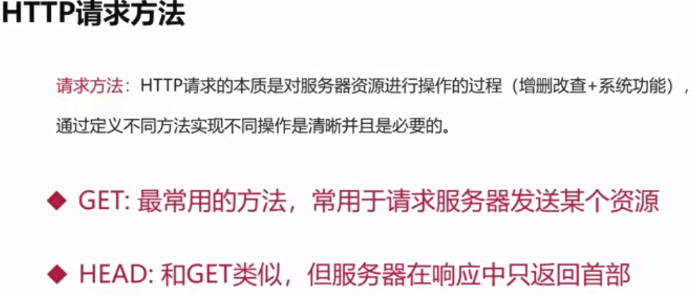
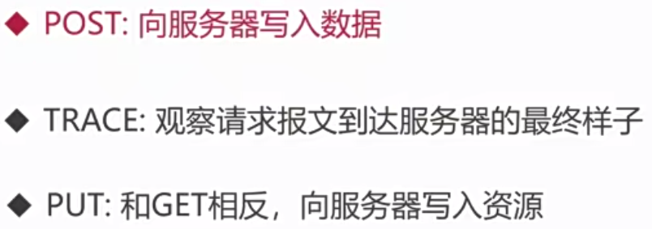
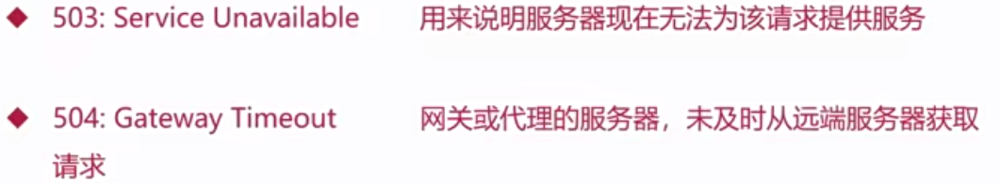
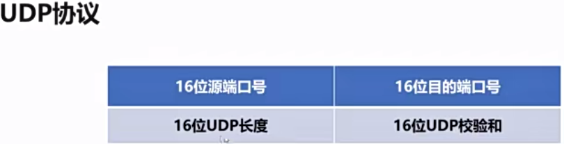
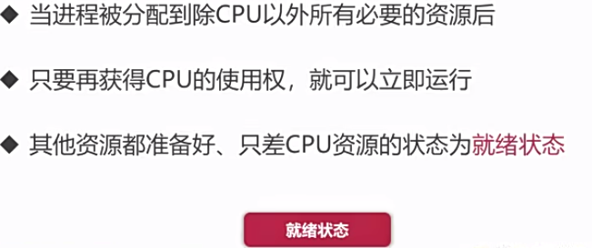

# 八股文

## 一、计算机网络

### 1.1 HTTP、HTTPS、DNS协议

#### 1.1.1 TCP、UDP属于什么层

1. 为什么要分层？

   分层设计：不同层实现不同功能   **类比**  函数设计：函数体不能太长

2. OSI七层作用

3. OSI七层与TCP/IP四层对应关系以及所用协议

4. 每一层的数据结构

5. 网络层特点

6. 传输层特点

7. 应用层特点

> 面试题
>
> ​	1.TCP、UDP、IP协议分别属于什么层
>
> ​	2.网络中传输层有什么作用？它有哪些协议

#### 1.1.2 HTTP1.0、1.1、2.0有什么区别

1. 各版本一些区别
2. keep-alive长连接的好处
3. HTTP2.0头部压缩通过哈夫曼编码和字典实现 

> 1. 简述HTTP1.0，1.1，2.0的主要区别
> 2. HTTP头Connection:Keep-alive是什么意思？解决了什么问题？

#### 1.1.3 HTTP状态码

1. HTTP报文结构

>  比如一个场景
>
> GET https://www/baidu.com HTTP/1.1
>
> Accept-Encoding:gzip
>
> Accept-Language:zh-CN
>
> {
>
> ​	"page":1,
>
> ​	"pageSize":5
>
> }

2. HTTP请求方法

3. 幂等操作：指对同一资源的多次操作，其结果与执行一次操作的效果相同

   幂等函数：指对于相同的输入值，多次调用函数的结果与单次调用的结果相同

4. HTTP状态码
5. 一些常见的状态码
6. 网关分配资源

#### 1.1.4 对称加密和非对称加密

1. 一种安全传输模型
2. 古典密码学是通过一一映射的，但是可以通过频率统计出来
3. 对称加密
4. 非对称加密
5. 对比
6. 哈希散列不是加密算法，因为哈希是单向的，不具备解密能力。即使通过哈希函数将用户密码保存进数据库了，也有风险被黑客破解(时间暴力枚举等等)，这时可以在哈希之前**加盐**，加盐就是在进行哈希散列的时候自定义一个字符串，将该字符串和原密码拼接，最后将这个整体一起哈希散列，加大破译难度

#### 1.1.5 HTTPS加密认证--TLS技术

1. HTTP与HTTPS对比
2. TLS
3. 数字证书，类似身份证，使用非对称加密

#### 1.1.6 域名系统DNS

1. 进程服务：IP+端口，比如115.182.41.180:443，但是这样太难记住了，那么
2. 域名工作原理
   1. 域名由点、字母、数字组成
   2. 点分隔不同域
   3. 域名分为顶级域、二级域、三级域
   4. 比如 www.baidu.com，www是三级域、baidu是二级域、com是顶级域
3. 那么这些域就组成了一棵树
4. DNS会优先在本机hosts文件里查找是否有映射，然后通过迭代或者递归查询

#### 1.1.7 DNS攻击

1. 比如我们请求的url是www.baidu.com，但是经过DNS解析后返回的是www.twly.com，将正常站点解析到恶意页面(赚取游戏推广费等等)
2. DNS劫持
3. DNS欺骗
4. DDos攻击是大量请求DNS解析服务器，使得网络或者系统资源耗尽，让服务中断或者停止，这样其他用户就无法正常访问了，防范手段：
   1. DNS服务商角度：提高本机安全些
   2. 个人角度：选择更加权威的服务商

### 1.2 IP、TCP、UDP协议

#### 1.2.1 TCP、UDP的区别 

1. UDP协议 
2. TCP协议
3. UDP vs TCP应用场景DNS通常处理大量的短期请求，而且这些请求的响应需要在短时间内迅速返回。UDP是无连接的，没有复杂的握手和确认过程，因此在速度和效率方面比TCP更合适。 DNS服务器通常面对的是大量的短暂请求，而非大量长连接。UDP在这种情境下更为适用，因为它允许更高的并发连接数量。

#### 1.2.2 TCP三次握手

1. 三次握手图解
2. 异常情况如果是两次握手，那么如果因为滞慢等原因没有及时传达，那就建立起两次连接，造成资源浪费如果是三次握手，就会保证建立的连接是可靠的、无差错的

#### 1.2.3 TCP四次挥手

1. TCP的释放
2. TIME-WAIT
3. TCP可靠运输-滑动窗口

4. 停止-等待协议
5. ARQ协议
6. 滑动窗口使得信息传递不再是串联，提高了速度

#### 1.2.4 TCP拥塞避免算法

1. 定义：拥塞是很多原因引发的，是一个全局问题
2. 慢开始与拥塞避免
3. 快重传与快恢复

#### 1.2.5 TCP粘包原理

1. 粘包并不是TCP协议造成的，而是应用层协议设计缺陷造成的
2. 应用层数据拆分
   1. 基于长度的标识
   2. 基于特殊分隔符
3. Nagle算法
4. 总结
5. TCP协议安全性
   1. SYN flood攻击，攻击方即是主动发送方
   2. 资源耗尽类攻击
   3. 协议特性漏洞攻击
   4. 防范手段

#### 1.2.6 虚拟专用网VPN

1. 场景
   1. 公司内网
   2. 校园网
   3. 工业专用网
2. 专用IP地址
3. 工作原理

## 二、操作系统

### 2.1 进程、线程和协程

#### 2.1.1 进程

1. 演进历史
2. 多道程序设计
   1. 在计算机内存中同时存放多个程序
   2. 在计算机的管理程序之下相互穿插运行 
   3. 用户无需面向硬件接口编程
   4. IO设备管理软件，提供读写接口
   5. 文件管理软件，提供操作文件接口
   6. **操作系统实现了对计算机硬件资源的管理和抽象**
3. 怎么隔离资源？调度程序？提高利用率？

#### 2.1.2 同步与异步

1. 五状态模型：创建、就绪、终止、阻塞、运行关系图如上，创建状态如下终止状态如上，完整关系图如下
2. 阻塞、非阻塞、同步、异步阻塞是由同步造成的一些常见的阻塞情况非阻塞的情况非阻塞就是通顺，是多路并行，是高效异步

#### 2.1.3  进程和线程的区别

1. 线程是什么线程共享进程资源二者对比多线程就可以充分利用CPU的资源

#### 2.1.4 用户态和内核态

1. 操作系统资源管理
   1. 处理器资源
   2. IO设备资源
   3. 存储器资源
   4. 文件资源
2. Linux设计
   1. 对不同操作赋予不同的执行等级
   2. 与系统相关的特别操作必须由最高权限完成
3. 内核态
4. 用户态
5. 二者切换的时机

#### 2.1.5 IO密集服务

1. 计算密集型
2. IO密集型
3. 对于计算密集型，应该使用多线程去充分利用CPU资源。对于IO密集，提升多线程效率已经没什么用了，但是可以提高硬盘读写速度
4. 服务部署

#### 2.1.6 协程

1. 上下文切换上下文切换势必有资源开销，那么进程与进程间的切换肯定是最大的
2. 协程协程的本质是用户级线程，一般的线程是内核级线程
3. 为什么协程叫做协作式线程？因为协程之间是相互让步、相互协作的。由用户自行调度，内核无法干涉。线程对协程是一对多
4. 协程优缺点

##  三、计算机系统

## 四、算法与数据结构

## 五、数据库

## 六、编程能力