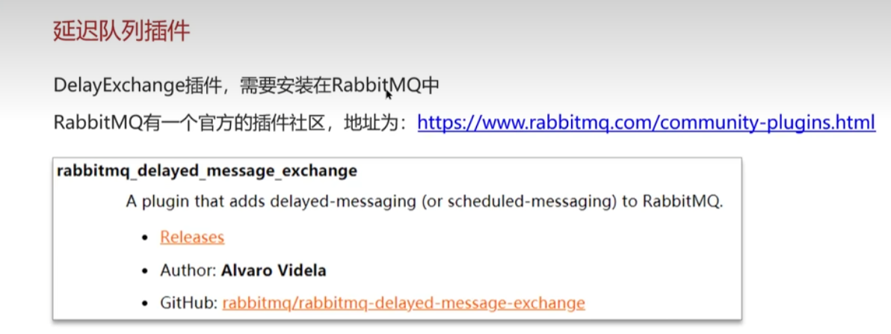
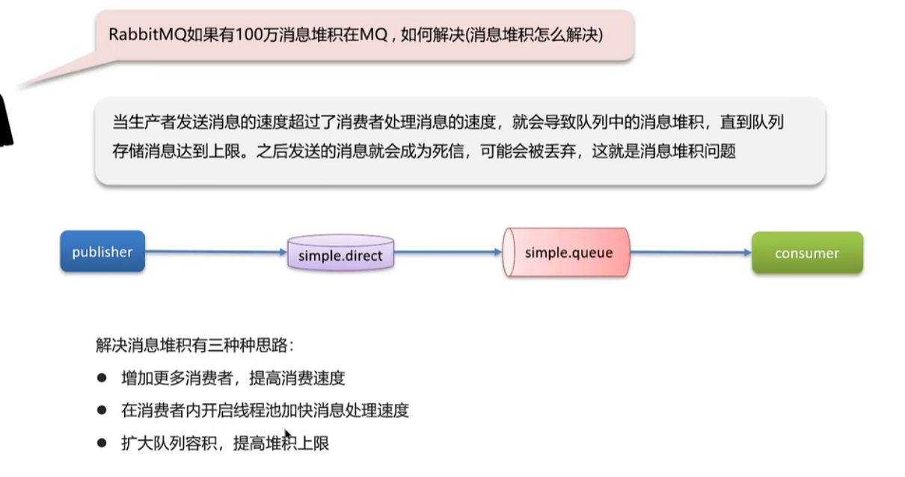
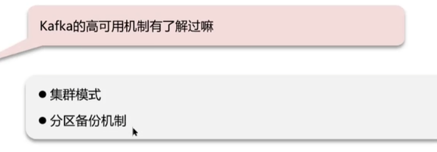
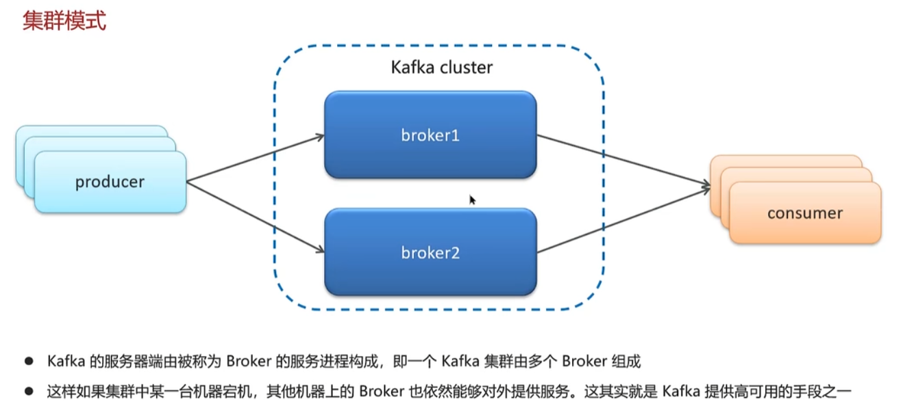
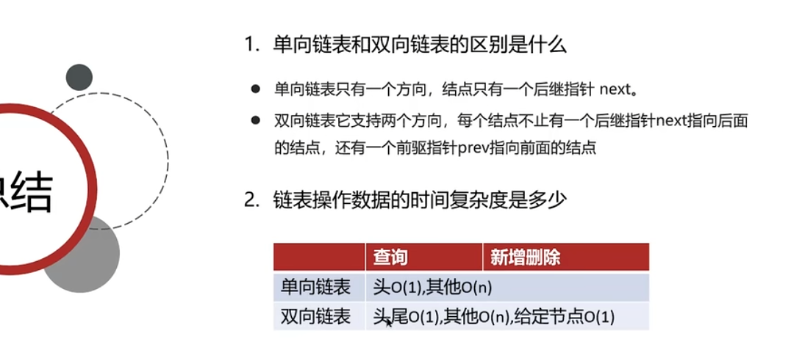
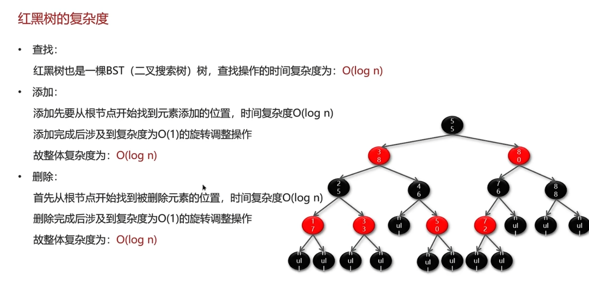
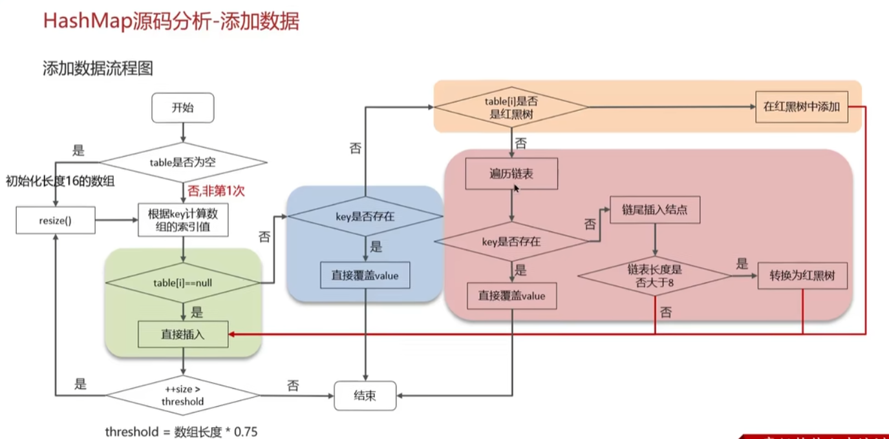

## 一、准备篇

1. 简历筛选规则
2. 简历注意事项**一定要列举出具体的点，引导面试官**
3. 合适的练手项目
4. Java面试过程

----------

## 二、Redis

1. 
2. 缓存-缓存穿透5%的误判率即可
3. 缓存-缓存击穿逻辑过期就是不注重一致性，注重可用性，先返回了。在数据里有个逻辑字段(类似数据库逻辑删除一样)，这个字段就是逻辑上的过期时间，如果过期，那么先把旧数据返回(并不会删除)，然后并行查询数据库缓存数据，写入缓存并重置过期时间
4. 缓存-缓存雪崩
5. 缓存-双写一致性谁先谁后都会出问题。为什么要删两次？以为有脏数据；为什么要延迟删除？因为mysql从节点要从主节点同步完成

这样是强一致，低性能

6. 缓存-持久化
7. 缓存-数据过期策略
8. 缓存-数据淘汰策略
9. 分布式锁-使用场景
10. 分布式锁-实现原理同一个线程的才可以重入两个线程持有一把锁了，有红锁
11. 集群方案-主从复制因为redis读多写少，所以从节点主读
12. 集群方案-哨兵模式脑裂就是因为网络原因暂时联系不上主节点，但是哨兵从从节点中选出了一个当做主节点
13. 集群-分片集群
14. redis是单线程的，为什么还那么快？因为用户态跟内核态有缓冲区，就导致特别慢

## 三、MySQL

1. 
2. 优化-如何定位慢查询
3. 优化-SQL执行的很慢，怎么分析？
4. 优化-索引以及底层红黑树在数据量很大时，会特别深
5. 聚簇索引与非聚簇
6. 优化-覆盖索引、最大分页优化所以为什么避免使用**select ***
7. 优化-索引创建原则
8. 优化-什么时候索引会失效
9. 优化-谈一谈优化SQL的经验
10. 事务-特性
11. 事务-并发事务、隔离级别叉叉是解决了的意思红字是不能解决的问题
12. 事务-undo log和redo log
13. 事务-解释MVCC、
14. 主从同步原理
15. 分库分表

## 四、框架篇

1. spring-单例bean是线程安全的吗就好像成员变量是...，而对象是引用
2. spring-aop相关
3. spring-事务失效
4. spring-bean的生命周期
5. spring-循环引用目前已经能解决绝大多数的问题了，但如果一个对象是增强的，即代理对象，那二级就不行了
6. springmvc-执行流程
7. Springboot自动装配原理
8. spring框架常见注解
9. mybatis-执行流程
10. mybatis-延迟加载以及原理
11. mybatis-一级、二级缓存

## 五、微服务

1. 
2. springcloud常见组件
3. springcloud-注册中心eureka、nacosAP是高可用，CP是强一致
4. springcloud-ribbon负载均衡
5. springcloud-服务雪崩、熔断降级降级是针对某个服务的某个接口，熔断是对整个服务的所有接口都拒绝
6. springcloud-监控skywalking通过红圈处分析是哪些导致慢速
7. 业务问题-微服务限流（漏桶算法、令牌桶算法漏桶是按照固定速率处理请求，而令牌桶是一定速率生成令牌，按照令牌数量处理请求，比如一秒可以生成五个令牌。那么一秒内五个请求内的都可以被处理，但是多余的就不行了
8. 分布式系统理论-CAP和BASE
9. 业务问题-分布式事务解决方案
10. 业务问题-分布式服务的接口幂等性
11. 业务问题-分布式任务调度

## 六、消息中间件

1. 
2. RabbitMQ-如何保证消息不丢失
3. RabbitMQ-重复消费的问题
4. RabbitMQ-死信交换机（延迟队列）以谁短为准
5. RabbitMQ-如何解决消息堆积
6. RabbitMQ-高可用机制
7. Kafka-保证消息不丢失出现问题是因为固定时间段提交，改成手动提交就行
8. Kafka-如何保证消费的顺序性
9. Kafka-高可用机制
10. Kafka-数据清理机制
11. Kafka-高性能设计这样需要拷贝很多次，效率低下，改进如下：

## 七、常见集合

1. 
2. 算法复杂度分析
3. ArrayList-数据结构-数组
4. ArrayList-源码分析以JDK8为例
5. ArrayList-底层实现原理只有真的添加数据的时候才会扩容
6. ArrayList-数组和List之间的相互转换
7. LinkedList-数据结构-链表双向链表时间复杂度
8. ArrayList和Like的List的区别是什么
9. 数据结构-二叉树
10. 数据结构-红黑树
11. 数据结构-散列表
12. HashMap-实现原理
13. HashMap-put方法的流程hashmap是懒加载，只有用到的时候才会初始化
14. HashMap-扩容机制
15. HashMap-源码分析
16. HashMap-寻址算法
17. HashMap-1.7情况下多线程死循环的问题因为1.7用的是头插法

## 八、并发编程

1. 
2. 线程基础-进程与线程的区别

126-134  高鹏

135-143  吕童

144-152  黄妍舒

153-161  韩冰清

162-170  王瑜若

171-179  冉芷萱

180-187  罗伟力

## 5

----------------

精简版

16. 
17. 
18. 
19. 
20. 
21. 
22. 
23. 
24. 
25. 
26. 
27. 
28. 
29. 
30. 
31. 
32. 

## 6

16.  
16. test